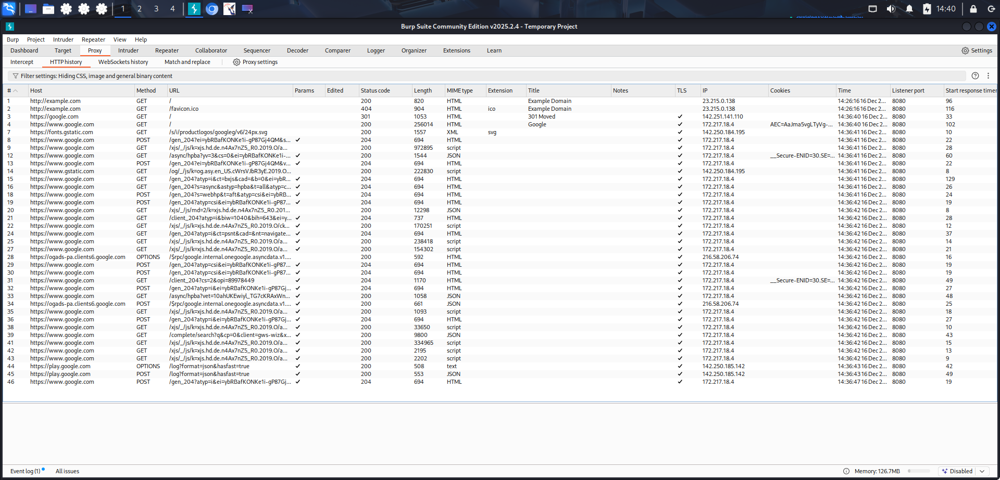

# SOC Incident Analysis – Suspicious Login Activity
Hands-on SOC incident analysis: SIEM, IR, log correlation, recommendations.

## 📌 Projektübersicht
Analyse eines simulierten SOC-Falls mit verdächtigen Login-Aktivitäten und möglichem Malware-Verdacht in einer virtuellen Laborumgebung.

## 🎯 Ziel des Projekts
- Analyse und Bewertung eines SIEM-Alarms
- Durchführung einer Incident-Triage
- Empfehlung geeigneter Gegenmaßnahmen

## 🧪 Umgebung & Setup
- VMware (Oracle VM VirtualBox)
- Kali Linux (Angreifer)
- Metasploitable (Zielsystem)

## 🛠️ Tools & Technologien
- SIEM
- EDR
- Wireshark

## 🧩 Szenario
Ein SIEM-Alarm meldete mehrere fehlgeschlagene Login-Versuche, gefolgt von einem erfolgreichen Zugriff aus einer ungewöhnlichen Quelle.

## 🔍 Analyse & Vorgehen
1. Analyse der Authentifizierungs-Logs im SIEM  
2. Überprüfung der Endpoint-Aktivitäten im EDR  
3. Korrelation von Netzwerkdaten mit Wireshark  
4. Identifikation verdächtiger IP-Adressen  

## 📊 Ergebnisse
- Einstufung: True Positive  
- Hinweise auf Brute-Force-Versuch mit anschließendem Zugriff  

## 🛡️ Maßnahmen & Empfehlungen
- Sperrung der betroffenen Benutzerkonten  
- Blockierung der IP-Adresse  
- Anpassung der Login-Richtlinien  

## 🧪 Web Traffic Analysis – Burp Suite

**Summary**
- Captured HTTP requests using Burp Suite proxy
- Analyzed request/response behavior
- Demonstrated understanding of web traffic inspection

**Tools**
- Burp Suite
- Kali Linux
- VirtualBox

## 📚 Learnings
- Praktische Erfahrung in SOC-Triage  
- Vertiefung der Log- und Netzwerkverkehrsanalyse  

## ⚠️ Hinweis
Alle Tests wurden ausschließlich in einer isolierten Laborumgebung durchgeführt.
